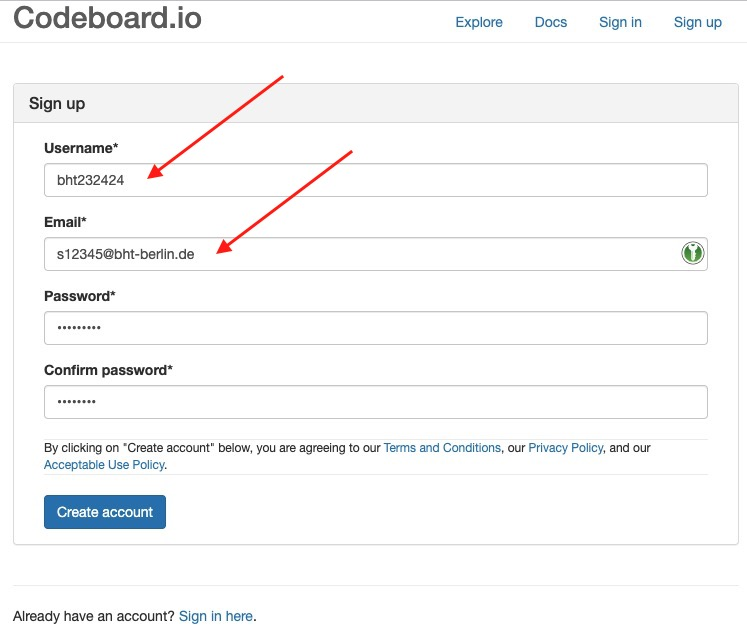

# Übung 0 – Einrichten von Konten, Beispiel-Übung, grafische Programmierung

## Bei 

ein Konto erstellen


[Codeboard](https://codeboard.io/) ist eine webbasierte IDE für den Programmierunterricht im Klassenzimmer. Einfaches Erstellen und Freigeben von Übungen für Schüler und Studenten ohne Installation von Software werden für Sie den Anfang mit der Programmierspache Java vereinfachen.

Sie werden Codeboard für das Bearbeiten und Einreichen der ersten Übungen nutzen. Um Ihre Einreichungn zuzuordnen, müssen Sie sie bei Codeboard registrieren.

### Registrierung

Bitte erstellen sie ein Codeboard-Konto unter folgender Url: https://codeboard.io/signup

- Verwenden Sie als `Benutzernamen` ihre Matrikel-Nummer im folgenden Aufbau `bht{MATRIKELNUMMER}`.
- Als `E-Mail Adresse` verwenden Sie ihre übliche Adresse (ihren [Campus-Account](https://doku.bht-berlin.de/account#studierende))
- Bitte verwenden Sie bei der Registrierung ein spezifisches Passwort, statt ihr Password des Campus-Accounts wiederzuverwenden.

___Beispiel:___
```
Username: bht232424
E-Mail: s12345@bht-berlin.de
```

<center>
  
</center>


## Beispiel Codeboard im Moodle aufrufen

Ist ihre Registrierung erfolgt, rufen Sie die [Beispiel-Übung im Moodle-Kurs](https://lms.bht-berlin.de/mod/lti/view.php?id=880528) auf. 

- Loggen Sie sich bitte mit ihrem Codeboard-Account ein:

<center>
  
</center>

- Um zu Prüfen ob Codeboard in Ihrem Browser funktioniert, betätigen Sie den `Compile` Button:

<center>
  
</center>


- Um zu Prüfen ob das Einreichen Ihrer Übungen funktioniert, betätigen Sie den `Submit` Button:

<center>
  
</center>

## Grafische Programmierung

Um mit der Programmierung warm zu werden empfehle ich folgenes Online-Labyrinth zu lösen:

- Gehen Sie auf den folgenden Link: https://blockly.games/maze?lang=de
- Versuchen Sie, das Spiel ganz zu Ende (Level 10) zu spielen.


---

<a href="https://www.pexels.com/photo/123-let-s-go-imaginary-text-704767/">

</a>

Ich wünsche Ihnen viel Spaß bei der Übung! 

