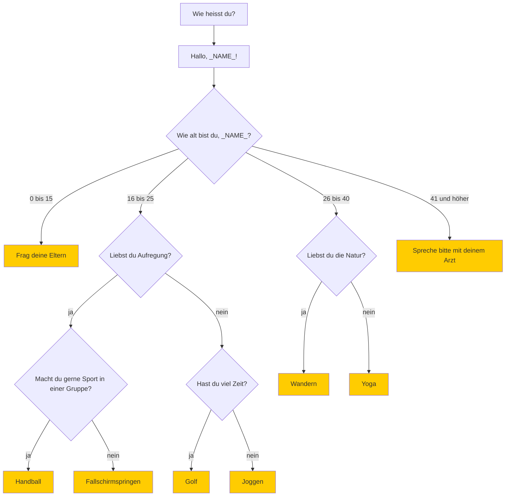

# Übung 2 – Sportratgeber


 *https://www.pexels.com/photo/crop-sportive-couple-clasping-hands-in-gym-6456305/*

## Einleitung

Schreiben Sie ein Programm, welcher ein Unterhaltungsroboter ist, der Ratschläge für Sport erteilt. Zunächst fragt der Roboter (d.h. unser Programm), wie der Ratsuchende (d.h. der menschliche Benutzer) heißt. Der Roboter grüßt den Ratsuchenden mit einem "Hallo" und mit dem Namen des Ratsuchendes. Dann stellt der Roboter verschiedene Fragen und gibt im Abschluss dem Ratsuchenden einen Rat

Das Programm läuft nach folgenden Regeln, die als Ablaufdiagramm dargestellt sind:



Wobei `_NAME_` für den Namen steht, den der Benutzer eingegeben hat.

## codeboard.io 

Rufen Sie das Codeboard zur [Übung 2 im Moodle-Kurs](https://lms.bht-berlin.de/mod/lti/view.php?id=896621) auf. 

Falls Sie in Codeboard nicht eingeloggt sind, melden Sie sich bitte mit dem Codeboard-Account ein, den Sie in der [Übung 0](../bht_pr1_submission_00/README.md) angelegt haben.

## Aufgabe

Es existiert eine Datei `Main.java`. In dieser ist Code enthalten, der einen `Scanner` erzeugt und wieder aufräumt. In dieser Date implementieren Sie ihre Lösung. Beachten Sie folgende Hinweise:

* Benutzen Sie geschachtelte `if`/`else` um den Ablauf der Entscheidungen zu steuern.
* Benutzen Sie `System.out.println()` um Fragen zu stellen und den finalen Rat des Roboters in der Konsole auszugeben.
* Benutzen Sie `Scanner` um Eingaben vom Benutzer zu verarbeiten.
* Benutzen Sie `String.equals()` um auf die Eingaben/Antworten des Benutzers zu reagieren.

### Code Konventionsn / Stil

* Beachten Sie die Einrückung (_indentation_) des Codes
* Schreiben Sie genug Kommentare, damit Sie oder jemand anderes ihr Programm besser verstehen kann.
* Vergeben sie sinnvolle Variablen-Namen, die zum Verständnis des Programms beitragen.
* "Hard-Coden" Sie keine Lösungen.
* Räumen Sie den `Scanner` ordentlich auf (das ist in dem Code, was ich für Sie erstellt habe, bereits gemacht).

## Hinweis für die Auto-Bewertung

* Alle Eingaben des Benutzers müssen so verarbeitet werden wie im Diagramm (siebe weiter oben). Beispielsweise muss die Antwort "ja" oder "nein" exakt in dieser Schreibweise (Kleinbuchstaben) erwartet werden.
* Die finale/letzte Ausgabe in der Konsole muss exakt dem Text eines der gelben Kästen entsprechen.
* Wenn Sie den Schalter `Test` in codeboard betätigen, werden 3 Testfälle gerüft. Sie sollten Ihren Code aber gründlich für verschiedene Randfälle von Eingaben des Benutzers prüfen, weil beim `Submit` weitere, gründlichere Tests exitieren, die Sie nicht sehen können (über 15 weitere Tests).

Eine Beispiel Ausgabe ihres Programms könnte so aussehen:
```
Wie heißt du?
Anna
Hallo, Anna!
Wie alt bist du, Anna?
20
Liebst du Aufregung?
nein
Hast du viel Zeit?
ja
Golf
```

---

<a href="https://www.pexels.com/photo/123-let-s-go-imaginary-text-704767/">

</a>

Ich wünsche Ihnen viel Spaß bei der Übung! 

