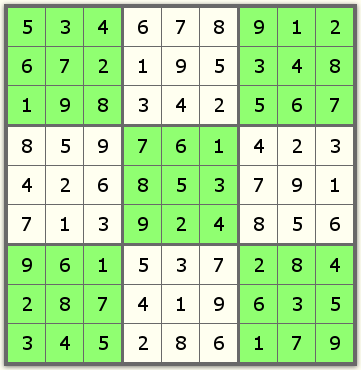

# Übung 5 – Sudoku-Lösung prüfen


 *https://www.pexels.com/photo/a-person-solving-a-puzzle-7257461/*

## Einleitung

Ihre Aufgabe ist es, ein Programm zu schreiben, welches eine gegebene Sudoku-Lösung auf ihre Gültigkeit überprüft.

Bei **Sudoku** sind Ziffern zwischen `1` und `9` in einem Quadrat mit `9x9` Zellen so zu verteilen, dass:
* Jede Ziffer in jeder Reihe (row) genau einmal vorkommt.
* Jede Ziffer in jeder Spalte (column) genau einmal vorkommt.
* Jede Ziffer in jedem Block (3x3 kleineres Quadrat) genau einmal vorkommt.

Z.B. ist die Aufstellung unten richtig:



### Sudoku auf der Konsole ausgeben "printSudoku"

In der ersten Teilaufgabe geben Sie die Sudoku-Lösung in der Console aus. Verwenden Sie dazu wie üblich `System.out.println` und `System.out.print`. 

Folgende Beispiel-Ausgabe wird erwartet:

```
+---------+---------+---------+
| 5  3  4 | 6  7  8 | 9  1  2 |
| 6  7  2 | 1  9  5 | 3  4  8 |
| 1  9  8 | 3  4  2 | 5  6  7 |
+---------+---------+---------+
| 8  5  9 | 7  6  1 | 4  2  3 |
| 4  2  6 | 8  5  3 | 7  9  1 |
| 7  1  3 | 9  2  4 | 8  5  6 |
+---------+---------+---------+
| 9  6  1 | 5  3  7 | 2  8  4 |
| 2  8  7 | 4  1  9 | 6  3  5 |
| 3  4  5 | 2  8  6 | 1  7  9 |
+---------+---------+---------+
```

Beachten Sie, dass alle Zeichen (Plus, Minus, Leerzeichen, Zahlen) exakt so ausgegeben werden müssen. 

### Sudoku prüfen und Ergebnis auf der Konsole ausgeben "checkSudoku"

Ermitteln Sie, ob das gegebene Sudoku korrekt gelöst ist. 

***Lösungsweg*** 

Die Summe der Ziffern 
* in einer Reihe, 
* Spalte 
* oder Block 

müssen die Zahl `45` ergeben. 

Im oberen Beispiel wäre die dritte Reihe:

```
|   ...   |   ...   |   ...   |
| 1  9  8 | 3  4  2 | 5  6  7 |
+---------+---------+---------+
|   ...   |   ...   |   ...   |

1 + 9 + 8 + 3 + 4 + 2 + 5 + 6 + 7 = 45
```

Im oberen Beispiel wäre die erste Spalte:

```
+-------
| 5  ... 
| 6  ... 
| 1  ... 
+-------
| 8  ... 
| 4  ... 
| 7  ... 
+-------
| 9  ... 
| 2  ... 
| 3  ... 
+-------

5 + 6 + 1 + 8 + 4 + 7 + 9 + 2 + 3 = 45
```

Im oberen Beispiel wäre der 3x3-Block in der ersten Zeile auf der rechten Seite:

```
----+---------+
... | 9  1  2 |
... | 3  4  8 |
... | 5  6  7 |
----+---------+
... |   ...   +

=> 9 + 1 + 2 + 3 + 4 + 8 + 5 + 6 + 7 = 45
```

Ihr Programm muss sich folgendermaßen verhalten:

***Reihen***
* Wenn alle Reihen korrekt sind (also die Summe der Ziffern `45` ergibt), soll ihr Programm folgende Ausgabe tätigen:
```
All rows are correct
```
* Sollte eine Reihe falsch gelöst sein, soll ihr Programm folgende Ausgabe tätigen (Beispiel):
```
Sum of row 2 is wrong. Sum is: 46
```
Dabei steht `2` für den Index der Reihe im Sudoku (angefangen bei `0`).

***Spalten***

* Wenn alle Spalten korrekt sind (also die Summe der Ziffern `45` ergibt), soll ihr Programm folgende Ausgabe tätigen:
```
All columns are correct
```
* Sollte eine Spalte falsch gelöst sein, soll ihr Programm folgende Ausgabe tätigen (Beispiel):
```
Sum of column 0 is wrong. Sum is: 46
```
Dabei steht `0` für den Index der Spalte im Sudoku (angefangen bei `0`).

***3x3-Blöcke***

Bei der Prüfung der 3x3-Blöcke bietet es sich an die *Reihen- und Spaltenbereiche* des jeweiligen Blocks zu prüfen:

```
  0  1  2   3  4  5   6  7  8 
+---------+---------+---------+
|         |         |         | 0
| 0-2|0-2 | 3-5|0-2 | 6-8|0-2 | 1
|         |         |         | 2
+---------+---------+---------+
|         |         |         | 3
| 0-2|3-5 | 3-5|3-5 | 6-8|3-5 | 4
|         |         |         | 5
+---------+---------+---------+
|         |         |         | 6
| 0-2|6-8 | 3-5|6-8 | 6-8|6-8 | 7
|         |         |         | 8
+---------+---------+---------+
```

* Wenn alle 3x3-Blöcke korrekt sind (also die Summe der Ziffern `45` ergibt), soll ihr Programm folgende Ausgabe tätigen:
```
All blocks are correct
```
* Sollte ein 3x3-Block falsch gelöst sein, soll ihr Programm folgende Ausgabe tätigen (Beispiel):
```
Sum of block rows: 6-8, columns: 0-2 is wrong. Sum is: 46
```
Dabei steht `6-8` für den horizontalen Index-Bereich des 3x3-Blocks, und `0-2` für den vertikalen (angefangen bei `0`).

## codeboard.io 

Rufen Sie das Codeboard zur [Übung 5 im Moodle-Kurs](https://lms.bht-berlin.de/mod/lti/view.php?id=905037) auf. 

Falls Sie in Codeboard nicht eingeloggt sind, melden Sie sich bitte mit dem Codeboard-Account ein, den Sie in der [Übung 0](../bht_pr1_submission_00/README.md) angelegt haben.

## Aufgabe

Es existiert eine Datei `Main.java`. Beachten Sie folgende Hinweise:

* Neben der `main` existieren in dieser Datei die zwei weitere Methoden `countEvensprintSudoku(int[][])` und  `checkSudoku(int[][])`. Ihre Implementationen schreiben Sie in der jeweiligen Methode.
* Jede dieser Methoden hat als Parameter ein 2d-Array mit der Sokudo-Lösung (`int[][] solution`). Dieser Wert dient als Eingabe, die Sie verarbeiten müssen. Beispiel:

```java
public static void printSudoku(int[][] solution) {
  // ...
}
```

---


### Code Konvention / Stil

* Beachten Sie die Einrückung (_indentation_) des Codes
* Schreiben Sie genug Kommentare, damit Sie oder jemand anderes ihr Programm besser verstehen kann.
* Vergeben sie sinnvolle Variablen-Namen, die zum Verständnis des Programms beitragen.
* "Hard-Coden" Sie keine Lösungen.

## Hinweis für die Auto-Bewertung

* Wenn Sie den Schalter `Test` in codeboard betätigen, werden einige wenige Testfälle gerüft. Sie sollten Ihren Code aber gründlich für verschiedene Randfälle von Eingaben des Benutzers prüfen, weil beim `Submit` weitere, gründlichere Tests exitieren, die Sie nicht sehen können.

---

<a href="https://www.pexels.com/photo/123-let-s-go-imaginary-text-704767/">

</a>

Ich wünsche Ihnen viel Spaß bei der Übung! 

