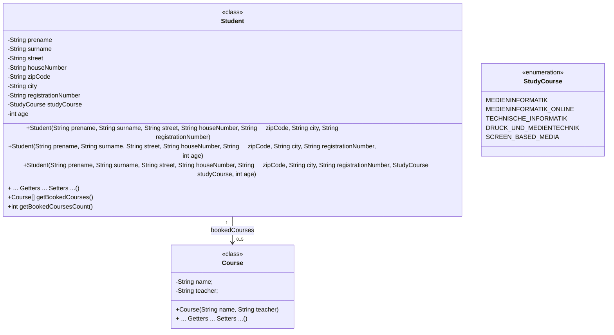

# Übung 8 – Studenten und Fächer


 *https://www.pexels.com/photo/adult-blur-books-close-up-261909/*

## Einleitung

Sie haben in der letzten Übung die `Student`-Klasse geschrieben. In dieser Übung ergänzen und verbessern Sie die Klasse mit weiteren Programmierungstechniken, und fügen weitere Klassen und Enumerationen hinzu.





## codeboard.io 

Rufen Sie das Codeboard zur [Übung 8 im Moodle-Kurs](https://lms.bht-berlin.de/mod/lti/view.php?id=912993) auf. 

Falls Sie in Codeboard nicht eingeloggt sind, melden Sie sich bitte mit dem Codeboard-Account ein, den Sie in der [Übung 0](../bht_pr1_submission_00/README.md) angelegt haben.

## Aufgabe

* Das codeboard-projekt enthält diesmal ***keine*** vorbereitete Klasse. Aktuell wird beim Start vom Programm folgender Fehler von Codeboard ausgegeben:

```
Error: Could not find or load main class student.Main
```

* Erstellen Sie ein neues Paket (Ordner) mit den Namen `student`, indem Sie im Codeboard-Menü auf "Project -> Add Folder" gehen. Alle Klassen die sie in dieser Übung erstellen sollten in diesem Paket liegen und in der ersten Zeile `package student;` enhalten.
* Die `Main.java`, die die Main-Methode enthält, müssen Sie selber anlegen. 

## Enumeration `StudyCourse`

Erstellen Sie im Paket `student` eine Enumeration für Studiengänge mit dem Namen `StudyCourse`.

* Die Studiengänge bei unserem Fachbereich sind:
  * Medieninformatik
  * Medieninformatik Online
  * Technische Informatik
  * Druck und Medientechnik
  * Screen Based Media

 Der Name einer Enum sollte mit mit Großbuchstaben geschrieben werden, wobei Wörter mit einem Unterstrich (`_`) getrennt werden. Bitte achten Sie auf die korrekte Schreibweise der Enumerations-Konstanten. Beispiel:
* `MEINE_TOLLE_KONSTANTE` (richtig)
* `meinetollekonstante` (falsch)
* `meine-tolle-konstante` (falsch)
* `meineTolleKonstante` (für Attribute und Variablen ok, für Konstanten falsch)

## Klasse `Course`

* Schreiben Sie im Paket `student` eine Klasse mit dem Namen `Course`, mit zwei Attributen `String name` und `String teacher`, einen Konstruktor der beide Attribute als Parameter trägt, und entspechende Getter und Setter.

## Klasse `Student`

* Kopieren Sie zudem Ihre `Student`-Klasse aus der letzten Übung und fügen Sie sie in das Paket `student` ein. Sie müssen in der ersten Zeile das Paket der Klasse deklarieren.
* Ersetzen Sie den Datentypen des Attributs `course` (Aktuell vom Typ `String`) und nutzen Sie ihre `StudyCourse` Enumeration.
* Das Attribut benennen Sie von `course` in `studyCourse` um. Denken Sie daran alle Konstruktor, Setter und Getter auch anzupassen (Datentyp und Benennnung).
* Fügen Sie der Klasse `Student` ein neues Attribut `age` vom Typ `int` hinzu.

### Konstruktoren

* Schreiben sie drei Konstruktoren für die `Student` Klasse:
** 

| Konstruktor | Parameter | Verhalten |
|-------------|-----------|-----------|
| 1           | String prename, String surname, String street, String houseNumber, String zipCode, String city, String registrationNumber | Aufruf von Konstruktor 2 und Übergabe eines Default-Alters von `20`      |
| 2           | String prename, String surname, String street, String houseNumber, String zipCode, String city, String registrationNumber, int age | Aufruf des Haupt-Konstruktors und Übergabe eines Default-Studiengangs `Medieninformatik`      |
| 3 (Haupt-Konstuktor)           | String prename, String surname, String street, String houseNumber, String zipCode, String city, String registrationNumber, StudyCourse studyCourse, int age | Zuweisung der Attribute der Klasse      |

### Getter/Setter

Schreiben Sie für alle Attribute der `Student` Klasse Getter und Setter.

### Erweitern der `Student` Klasse zum das Belegen von Fächern (`Course`) zu ermöglichen

* Erweitern Sie die `Student` Klasse einem neuen Attribut `Course[] bookedCourses`, welches die gebuchten Kurse eines Studenten pflegt. Die länge des Arrays soll `5` sein.
* Im Konstruktor 3 (Haupt-Konstruktor) füllen Sie bitte alle Felder des `bookedCourses`-Arrays mit dem Wert `null`.
* Schreiben Sie eine Methode `bookCourse(Course course)`, die im `bookedCourses` Array den nächsten freien Platz findet (also `!= null`) und den Kurs, welches die Methode über den `course` Parameter empfängt, speichert.
* Sind bereits alle Plätze im Array (`5`) gefüllt, so soll nichts passieren (es soll also kein Wert überschrieben werden).

* Schreiben Sie eine Methode `int getBookedCoursesCount()`, die die Anzahl der gebuchten Kurse liefert.

## Beispiel-Code

Ich empfehle Ihnen in der `main` Methode der `Main` Klasse ihre Klassen aufzurufen um sich selbst zu demonstrieren ob ihr Code funktioniert, so wie ich für Sie in allen bisherigen Übungen die Main-Methode vorbereitet habe. Ab Jetzt können Sie das selber machen, da bin ich sicher.

---


### Code Konvention / Stil

***In dieser Übung speziell***
* Verwenden Sie kein `static` bei Methoden oder Attributen, wenn es nicht notwendig ist.
* Halten Sie möglichst alle Attribute `private`, bis Sie einen Grund haben es `public` zu machen. 
* Getter für private Attribute sind besser, als ein Attribut public zu machen.

***Generell***
* Beachten Sie die Einrückung (_indentation_) des Codes
* Schreiben Sie genug Kommentare, damit Sie oder jemand anderes ihr Programm besser verstehen kann.
* Vergeben sie sinnvolle Variablen-Namen, die zum Verständnis des Programms beitragen.
* "Hard-Coden" Sie keine Lösungen.

## Hinweis für die Auto-Bewertung

* Wenn Sie den Schalter `Test` in codeboard betätigen, werden einige wenige Testfälle gerüft. 
* Sie sollten Ihren Code aber gründlich für verschiedene Randfälle von Eingaben des Benutzers prüfen. In dieser Übung gibt es keine weiteren Extra-Tests, die bei `Submit` ausgeführt werden. Sie können also alle Tests sehen, mit denen Sie 100% der Punkte erreichen können.

---

<a href="https://www.pexels.com/photo/123-let-s-go-imaginary-text-704767/">

</a>

Ich wünsche Ihnen viel Spaß bei der Übung! 

